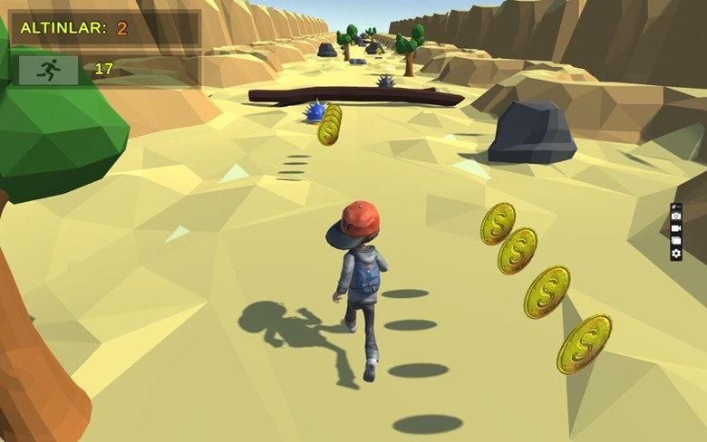
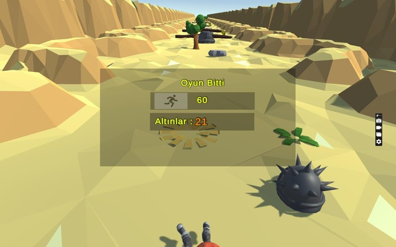

# 🏃 Sonsuz Koşucusu Oyunu - Endless Runner Game

## 🎮 Sonsuz Koşucusu'na Hoş Geldiniz

Engellerden kaçınarak ve altınları toplayarak uçsuz bucaksız bir çölün içinde koştuğunuz heyecan dolu bir sonsuz koşu oyunu!  
Subway Surfers gibi tempolu oyunlardan ilham alınarak geliştirilen bu yapım, etkileyici görselleri ve akıcı oynanışıyla dikkat çekiyor.

---

## 📌 Açıklama

**Sonsuz Koşucusu**, Unity kullanılarak geliştirilen bir sonsuz koşu oyunudur.  
Oyuncular, geniş bir çöl ortamında bir karakteri kontrol eder, engellerin üzerinden atlayarak ve altınları toplayarak yüksek puanlara ulaşmaya çalışır.  
Oyun, akıcı animasyonlar, duyarlı kontroller ve çarpıcı çöl teması sunar.

---

## 🚀 Özellikler

- **Sonsuz Koşu**: Ne kadar uzun süre koşarsan, o kadar yüksek puan alırsın.  
- **Engellerden Kaçınma**: Çöl ortamındaki çeşitli engellerin üzerinden atla veya etrafından dola.  
- **Altın Toplama**: Skorunu artırmak ve özel öğelerin kilidini açmak için altınları topla.  
- **Etkileyici Grafikler**: Göz alıcı çöl manzaraları ve pürüzsüz animasyonlar.  
- **Sezgisel Kontroller**: Kolay kullanılabilir ve kullanıcı dostu kontroller ile keyifli bir deneyim.

---

## 🕹️ Oynanış

- **Amaç**: Engellerden kaçınarak ve altın toplayarak mümkün olduğunca uzun süre koş.  
- **Kontroller**:  
  - Bilgisayarda: Ok tuşlarını kullan  
  - Mobilde: Kaydırma hareketlerini kullan  
- **Engeller**:  
  - Kayalara zıpla  
  - Kemerlerin altından kayarak geç  
  - Çöldeki tehlikelerden uzak dur  
- **Altınlar**:  
  - Skorunu artırmak için topla  
  - Özel içeriklerin kilidini açmak için kullan

 

---

## 📬 İletişim

Görüş ve önerileriniz için:

📧 **sahir.alzakaria@gmail.com**
